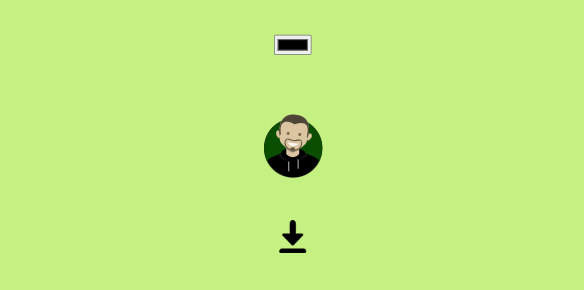

# Modify and Download Inline SVG

For a couple days I could not find an explanation of how to do this simple (seeming!) task!

Deployment: [Codepen](https://codepen.io/mlorberdev/details/eYjgZmg)

## Code Abstract

Mod your inline SVG as per usual programming.

My code does the following:
* Grab SVG outerHTML (i.e. between the svg tags)
* URL-encode using replaceAll
* Create anchor, set href to URL-encoding
* Append, click and remove anchor

### Raw JS
```js
document.getElementById("download").addEventListener("click", () => {
    // ENCODE AND DOWNLOAD MODIFIED SVG
    let svg = document.getElementById("avatar").outerHTML.toString(); // NB: AVATAR IS THE SVG ID
    let target = `data:image/svg+xml,${svg.replaceAll("\r", "").replaceAll("\t", "").replaceAll("\n", "").replaceAll('"', "'").replaceAll("<", "%3C").replaceAll(">", "%3E").replaceAll("#", "%23")}`; // NB: URL ENCODING
    let a = document.createElement("a");
    a.href = target;
    a.download = `file.svg`;
    document.body.appendChild(a);
    a.click();
    a.remove();
  });
```

## Screenshot

